# GitOps Engine & ArgoCD High-Availability Architecture

In **LambertLab**, Git is the absolute single source of truth for all Kubernetes cluster state. Cluster workloads, operators, Custom Resource Definitions (CRDs), and virtual machines are reconciled declaratively by **ArgoCD High Availability (HA)**.

---

## 🔄 App-of-Apps Topology & Sync Waves

```mermaid
graph TD
    Root["root-apps Application<br/>App-of-Apps Pattern"] --> Wave0["Sync Wave 0: AppProjects"]
    Root --> Wave1["Sync Wave 1: Foundation & Operators"]
    Root --> Wave2["Sync Wave 2: Config, Security & Gateways"]
    Root --> Wave3["Sync Wave 3: Workloads & Virtual Machines"]

    subgraph W0["Wave 0: Scaffolding"]
        Wave0 --> P1["infrastructure Project"]
        Wave0 --> P2["security Project"]
        Wave0 --> P3["media Project"]
        Wave0 --> P4["observability Project"]
        Wave0 --> P5["gaming Project"]
    end

    subgraph W1["Wave 1: Foundation & Operators"]
        Wave1 --> Longhorn["Longhorn Storage Helm"]
        Wave1 --> Multus["Multus Thick CNI DaemonSet"]
        Wave1 --> KubeVirtOp["KubeVirt & CDI Operators"]
        Wave1 --> CertMgr["Cert-Manager Helm v1.21.2"]
        Wave1 --> NMStateOp["kubernetes-nmstate Operator"]
        Wave1 --> GPUOp["NVIDIA GPU Operator"]
    end

    subgraph W2["Wave 2: Security, Config & Gateways"]
        Wave2 --> Vault["HashiCorp Vault"]
        Wave2 --> ExtSecrets["External Secrets Operator"]
        Wave2 --> ClusterCfg["CoreDNS AD Forwarder & Traefik TLSStore"]
        Wave2 --> NMStatePol["br-lab0 VXLAN Overlay Policy"]
        Wave2 --> Guac["Apache Guacamole Gateway"]
        Wave2 --> KVMgr["KubeVirt Manager Web UI"]
        Wave2 --> ExtSvc["External Services EndpointSlices"]
    end

    subgraph W3["Wave 3: Consumer Workloads & VMs"]
        Wave3 --> DC01VM["DC01 Active Directory VM"]
        Wave3 --> Win11VM["Win11 Admin Workstation VM"]
        Wave3 --> OPNsenseVM["OPNsense Firewall VM"]
        Wave3 --> MediaStack["Jellyfin / Sonarr / Radarr / Prowlarr"]
        Wave3 --> ObsStack["Homarr / Ntfy"]
        Wave3 --> GamingStack["Palworld Dedicated Server"]
    end
```



---

## ⚡ High-Availability Controller Architecture

ArgoCD is deployed in full **High Availability (HA)** mode across the 3-node control plane quorum (`lenovo`, `optiplex`, `opti74`):

1. **Redis Sentinel Clustering:** Multi-replica Redis state cache with automated master failover.
2. **Controller Sharding:** Active-active application controller replicas distribute sync loops and health evaluation pipelines evenly across nodes.
3. **Internal Backend TLS (`server.insecure: true`):** Traefik terminates client TLS at the edge using the wildcard `*.lambertlab.us` certificate, then communicates with `argocd-server` via an internal `ServersTransport` with insecure verification disabled.
4. **Strict Default-Deny RBAC:** Unauthorized users logging in via Microsoft Entra ID OIDC receive zero application view permissions by default (`policy.default: role:''`). Only members of the configured administrator directory group inherit `role:admin`.

---

## 🌊 Deterministic Synchronization Waves

ArgoCD assigns resources to discrete, sequential **Sync Waves** (evaluated in ascending numeric order). Wave $N+1$ does not initiate until Wave $N$ reaches a healthy, synchronized state:

| Sync Wave | Category | Primary Resources & Applications | Architectural Purpose |
| :---: | :--- | :--- | :--- |
| **`0`** | **AppProjects Scaffolding** | `infrastructure`, `security`, `media`, `observability`, `gaming` | Establishes project RBAC boundaries, source repo constraints, and allowed cluster destinations. |
| **`1`** | **Foundation & Storage** | `longhorn`, `multus`, `kubevirt`, `cdi`, `cert-manager`, `nmstate-operator`, `nvidia-gpu-operator` | Installs core storage drivers, CNI plugins, hypervisor operators, and foundational CRD schemas. |
| **`2`** | **Security & Core Gateways** | `vault`, `external-secrets`, `cluster-config`, `nmstate-policies`, `guacamole`, `kubevirt-manager`, `external-services` | Configures VXLAN networking (`br-lab0`), secrets engines, custom DNS forwarders, and clientless gateways. |
| **`3`** | **Consumer Workloads & VMs** | `dc01`, `win11`, `opnsense`, `jellyfin`, `sonarr`, `radarr`, `prowlarr`, `homarr`, `ntfy`, `palworld` | Deploys active virtual machines, database consumers, media applications, and game servers. |

---

## 🛠️ Drift Mitigation & `ignoreDifferences` Mechanics

Because certain Kubernetes controllers dynamically inject runtime metadata into managed objects, strict GitOps engines will flag non-existent drift unless configured with targeted `ignoreDifferences`:

### 1. StatefulSet `volumeClaimTemplates`
When StatefulSets (such as `vault`, `ntfy`, and `guacamole-postgresql`) scale up, the Kubernetes storage controller mutates volume claim templates with internal annotations (`volume.beta.kubernetes.io/storage-provisioner`). ArgoCD application manifests explicitly ignore these controller-injected fields:

```yaml
ignoreDifferences:
  - group: apps
    kind: StatefulSet
    jsonPointers:
      - /spec/volumeClaimTemplates
```

### 2. KubeVirt & CDI Dynamic CRD Schemas
KubeVirt DataVolumes and CDI upload proxies append dynamic status hashes and upload tokens (`cdi.kubevirt.io/storage.pod.phase`). ArgoCD ignores runtime CDI annotations to prevent false out-of-sync indicators while preserving GitOps authority over storage sizes and source definitions.
