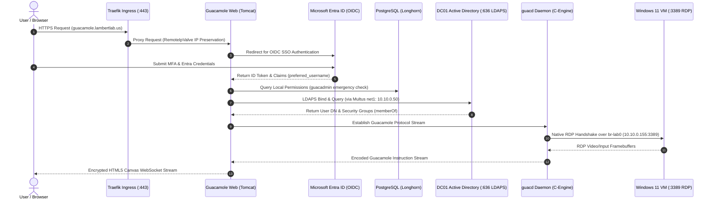

# Apache Guacamole Clientless Gateway Architecture

**Apache Guacamole** serves as the centralized, clientless remote desktop gateway for the **LambertLab** infrastructure, providing secure, browser-based HTML5 access to virtual machines and physical servers without requiring client software, browser plugins, or external VPN clients.

---

## 🥑 System Architecture & Network Ingress



---

## 🔒 Internal LDAPS Root CA Injection (Port 636)

By default, Java virtual machines (JVM) reject private internal Certificate Authorities when establishing TLS/SSL handshakes over LDAPS (TCP port 636).

### The Challenge
Active Directory Domain Services on `dc01.ad.lambertlab.us` signs its LDAPS certificate using the internal root CA (`lambertlab-DC01-CA`). Standard Guacamole container images do not trust private internal PKIs, throwing `javax.net.ssl.SSLHandshakeException: PKIX path building failed`.

### The Automated Solution: InitContainer Keystore Merging
Rather than rebuilding custom Docker images, the Guacamole deployment manifest uses an Alpine Linux `initContainer` (`eclipse-temurin:21-jre-alpine`) that merges the internal root certificate into Java's standard `cacerts` keystore at startup on an `emptyDir` volume:

```yaml
# kubernetes/guacamole/values.yaml
extraInitContainers:
  - name: inject-ca-cert
    image: eclipse-temurin:21-jre-alpine
    command:
      - sh
      - -c
      - |
        cp $JAVA_HOME/lib/security/cacerts /custom-truststore/custom-cacerts
        keytool -importcert -noprompt \
          -alias ad-root-ca \
          -file /certs/ad-root-ca.crt \
          -keystore /custom-truststore/custom-cacerts \
          -storepass changeit
    volumeMounts:
      - name: ad-ca-volume
        mountPath: /certs/ad-root-ca.crt
        subPath: ad-root-ca.crt
      - name: truststore-volume
        mountPath: /custom-truststore
```

The resulting trusted keystore is mounted read-only into the primary Tomcat container at `/etc/ssl/certs/java`, and activated via JVM environment parameters:

```yaml
extraEnv:
  - name: JAVA_TOOL_OPTIONS
    value: >-
      -Djavax.net.ssl.trustStore=/etc/ssl/certs/java/custom-cacerts
      -Djavax.net.ssl.trustStorePassword=changeit
      -Dcom.sun.jndi.ldap.object.disableEndpointIdentification=true
```

> [!TIP]
> **Why `disableEndpointIdentification=true` is Required:**
> Java's JNDI LDAP provider performs strict hostname endpoint identification. In virtualized lab environments where the AD domain controller certificate Subject Alternative Name (SAN) may match `dc01.ad.lambertlab.us` while routing takes place over static L2 IP mappings (`10.10.0.10`), disabling endpoint identification prevents spurious TLS hostname mismatches while preserving full cryptographic channel encryption.

---

## ⛓️ Multi-Provider Authentication Chaining

Guacamole is configured with dual authentication extensions:
1. **Microsoft Entra ID (OpenID Connect / OIDC):** Provides modern Web SSO with MFA for daily interactive web users.
2. **Active Directory LDAPS:** Authenticates against on-premises Active Directory and maps group memberships (`Guacamole-Admins`).
3. **Local Database (PostgreSQL):** Preserves break-glass recovery access for the local `guacadmin` administrator.

### The `EXTENSION_PRIORITY` Directive
When combining multiple authentication backends, Guacamole must know which provider takes precedence:

```yaml
- name: EXTENSION_PRIORITY
  value: "*,openid"
```

Setting `EXTENSION_PRIORITY: "*,openid"` enforces that the local database and LDAP extensions execute *before* the OpenID Connect redirect kicks in. This ensures that the built-in `guacadmin` emergency account can always log in directly via the web form if internet connectivity or Entra ID is degraded.

---

## 🌉 Software-Defined L2 Network Bridging (Multus CNI)

Standard Kubernetes pods route egress traffic through flannel SNAT gateways, preventing direct Layer 2 connectivity to virtual machines and triggering firewall inspection delays.

Guacamole overcomes this by utilizing **Multus CNI** to attach directly to the cluster-wide multicast VXLAN bridge (`br-lab0`):

```yaml
podAnnotations:
  k8s.v1.cni.cncf.io/networks: '[{
    "name": "lab-lan-bridge",
    "ips": ["10.10.0.50/24"]
  }]'
```

* **Interface `net1`:** Receives static IP `10.10.0.50` directly on the `10.10.0.0/24` subnet.
* **Direct RDP/SSH Access:** RDP connections to `win11` (`10.10.0.155:3389`) and LDAPS queries to `dc01` (`10.10.0.10:636`) flow across the VXLAN tunnel with **sub-millisecond latency** and zero NAT traversal.

---

## 🛡️ Compute Guardrails & Proxy Hygiene

### 1. `guacd` CPU Core Capping
When scheduled on `workstation` (16-core / 32-thread Xeon), `guacd` detects 32 logical cores and spawns 32 worker threads. To protect machine learning and Elasticsearch indexing pipelines:

```yaml
guacd:
  resources:
    requests:
      cpu: "100m"
      memory: "128Mi"
    limits:
      cpu: "2000m"      # Hard-capped at 2 cores
      memory: "1024Mi"
```

### 2. Client IP Preservation
To prevent proxy lockouts caused by internal flannel overlay IPs (`10.42.x.x` appearing as the client IP), Tomcat's `RemoteIpValve` is configured with a permissive internal regex:

```yaml
proxy:
  enabled: true
  allowedIpsRegex: ".*"
  ipHeader: X-Forwarded-For
  protocolHeader: X-Forwarded-Proto
```

### 3. Virtual Drive Sharing Permissions
When enabling RDP virtual drive redirection (allowing users to upload/download files to VMs through the browser), the drive path must be set to `/tmp` (not `/var/lib/guacamole`). Because `guacd` runs as an unprivileged container user, using `/tmp` ensures proper Linux write permissions for drag-and-drop file transfers.
