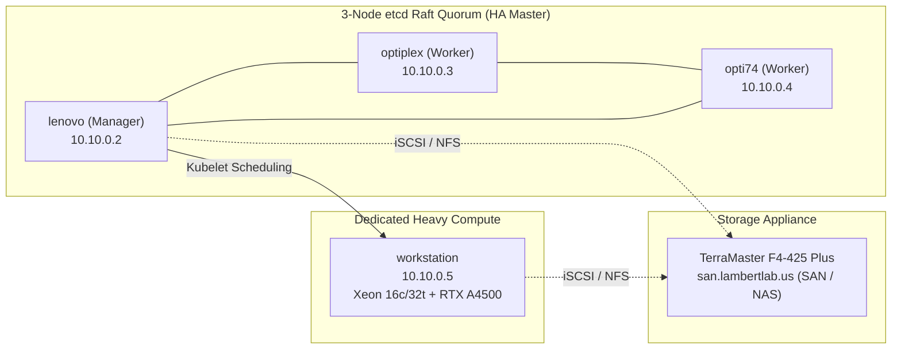

# Hardware Architecture & Cluster Topology

The **LambertLab** physical cluster balances high-availability Kubernetes control plane quorum with heavy GPU and SIEM compute.

---

## 🖥️ Physical Node Fleet

| Node Hostname | Hardware Model | CPU & Architecture | Memory | Storage Devices | Primary Responsibilities |
| :--- | :--- | :--- | :--- | :--- | :--- |
| **`lenovo`** | Lenovo ThinkCentre M700 | Intel Core i7-6700T (4c/8t @ 3.6 GHz) | 32 GB DDR4 | 128 GB SSD | Primary manager, etcd quorum member #1, local Traefik ingress, K3s control loop |
| **`optiplex`** | Dell OptiPlex 9020 | Intel Core i7-4770 (4c/8t @ 3.9 GHz) | 16 GB DDR3 | 250 GB SSD | etcd quorum member #2, Tailscale subnet router (Physical LAN & Overlay `10.10.0.0/24`) |
| **`opti74`** | Dell OptiPlex 7040 | Intel Core i7-6700 (4c/8t @ 4.0 GHz) | 32 GB DDR4 | 256 GB NVMe + 1 TB HDD | etcd quorum member #3, worker workloads, dedicated Palworld game server |
| **`workstation`** | Supermicro X10DAi | Dual Intel Xeon E5-2667 v4 (16c/32t @ 3.6 GHz) | 128 GB ECC | 256 GB NVMe + 500 GB SSD + 250 GB SSD | NVIDIA RTX A4500 (20GB VRAM), Docker ELK Stack (Elasticsearch, Logstash, Kibana), heavy worker compute |
| **TerraMaster NAS** | TerraMaster F4-425 Plus | Intel Quad-Core (`san.lambertlab.us`) | 8 GB | 4-Bay SATA SSD / HDD Array | Raw iSCSI target LUNs (VM boot disks) & 14TB bulk NFS pool |

---

## ⚖️ K3s High Availability & Quorum

The Kubernetes cluster runs **K3s v1.36** utilizing an embedded **`etcd` Raft consensus engine** distributed across the 3 control plane nodes:



### Fault Tolerance & Master Failover
* **Quorum Calculation:** A 3-node etcd cluster tolerates N = floor((3 - 1) / 2) = 1 node failure. If any single control plane node reboots, cluster state synchronization and API server operations remain uninterrupted.
* **Embedded Simplicity:** Embedded etcd eliminates external database maintenance (e.g. external PostgreSQL/MySQL), using Raft state machines directly inside the K3s supervisor binary.

---

## ⚡ Workstation Dual Role & Compute Guardrails

`workstation` serves a dual purpose: it acts as a Kubernetes worker node scheduling GPU-accelerated workloads (Jellyfin transcoding, Tdarr pipelines) while simultaneously serving as a bare-metal Docker host running the centralized **ELK Stack (Elasticsearch, Logstash, Kibana)** for Security Information and Event Management (SIEM).

!!! warning "Crucial Compute Guardrail: Guacamole / `guacd` Thread Capping"
    Because `workstation` has a 16-core / 32-thread Xeon CPU, services that dynamically probe host hardware (such as Apache Guacamole's `guacd` proxy) will automatically probe `sysconf` and spawn **32 concurrent worker threads** if uncapped.

    To ensure that the host RTX A4500 GPU compute and Elasticsearch indexing pipelines remain completely unthrottled:
    
    ```yaml
    # kubernetes/guacamole/values.yaml
    guacd:
      resources:
        requests:
          cpu: "100m"
          memory: "128Mi"
        limits:
          cpu: "2000m"      # Hard-capped at 2 cores
          memory: "1024Mi"
    ```
    Capping `guacd` at `2000m` leaves 30 CPU threads completely free for Elasticsearch indexing, Machine Learning models, and media transcoding pipelines.

---

## 🧹 Host Storage Hygiene & Operational Rules

!!! danger "Node Storage Guardrails"
    - **Lenovo Manager SSD:** Lenovo's primary root NVMe drive (`/dev/sda2`) is approximately 116 GB. Retain snap packages at 2 (`sudo snap set system refresh.retain=2`) and periodically purge system journal logs (`journalctl --vacuum-time=3d`) or runner cache.
    - **No VM Disk Staging on Lenovo:** Under no circumstances should 25+ GB virtual machine disk images, ISO files, or CDI scratch volumes be staged on Lenovo's local root disk. All ISOs must be placed on the TerraMaster NAS (`/Volume3/isos`).
    - **Strict Mount Prohibitions:** Tools, automated scripts, and agents must never inspect, list, read, or execute against `/mnt/blue_drive/`, `/mnt/black_drive/`, or `/mnt/media_data/` on any node.

---

## 🔌 Remote Access & Node Management

Nodes are accessible via SSH and managed via Docker contexts:

```bash
# Direct SSH by hostname over LAN or Tailscale
ssh lenovo
ssh optiplex
ssh opti74
ssh workstation

# Multi-Node Docker Contexts (Managed from Lenovo)
docker --context default ps             # Local lenovo node
docker --context optiplex ps            # Optiplex 9020
docker --context opti74 ps              # Optiplex 7040
docker --context workstation-engine ps  # Workstation (ELK stack)
```
