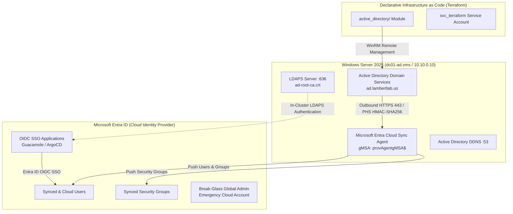
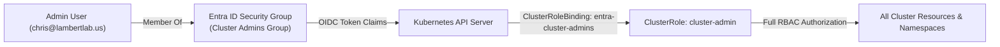

# Hybrid Identity Architecture & Active Directory Federation

The **LambertLab** identity architecture unifies on-premises Windows Active Directory Domain Services with **Microsoft Entra ID** (formerly Azure AD), providing a zero-trust dual-directory security model with centralized Role-Based Access Control (RBAC).

---

## 🆔 Hybrid Identity Topology



---

## 🏛️ Domain Architecture & Forest Design

| Parameter | Configuration Value | Architectural Rationale |
| :--- | :--- | :--- |
| **Active Directory Domain (FQDN)** | `ad.lambertlab.us` | Dedicated sub-domain isolating internal AD infrastructure from apex public DNS records. |
| **NetBIOS Name** | `LAMBERTLAB` | Legacy compatibility for Windows 11 domain logins (`LAMBERTLAB\username`). |
| **Primary Cloud Domain** | `lambertlab.us` | Custom domain verified via Cloudflare DNS TXT record (`MS=ms33191728`). |
| **Alternative UPN Suffix** | `lambertlab.us` | Configured on AD root domain so users log in seamlessly as `user@lambertlab.us`. |
| **Domain Controller Hostname** | `dc01-ad.vms` | KubeVirt VM pinned to static IP `10.10.0.10` on software-defined `br-lab0`. |
| **Directory Functional Level** | Windows Server 2025 | Enables modern Kerberos cryptographic suites and enhanced gMSA policies. |

---

## 🔄 Microsoft Entra Cloud Sync & Password Hash Sync (PHS)

Instead of running heavyweight legacy Azure AD Connect servers with local SQL Server Express databases, LambertLab deploys the lightweight **Microsoft Entra Cloud Sync Agent** directly on `dc01`:

### 1. Group Managed Service Account (`gMSA`)
The sync agent executes under a native Windows Group Managed Service Account (`provAgentgMSA$`):
* **Zero-Touch Maintenance:** Active Directory automatically negotiates and rotates a 128-character cryptographically random password every 30 days.
* **Service Principal Isolation:** Eliminates static plaintext service account credentials from registry hives or memory dumps.

### 2. Password Hash Synchronization Security
* Passwords never traverse the network in cleartext or standard NTLM format.
* The Cloud Sync agent extracts the user's NTLM hash from the AD database (`ntds.dit`), salts it, and hashes it through **1,000 rounds of HMAC-SHA256** before transmitting it over TLS 1.3 to Microsoft Entra ID.
* Synchronization latency is deterministic (< 2 minutes from on-prem password update to cloud availability).

### 3. Scoping Filter Configuration
To ensure tight security hygiene and prevent syncing unnecessary system accounts, the Cloud Sync configuration enforces explicit Organizational Unit (OU) scoping:

```text
OU=Users,OU=LambertLab,DC=ad,DC=lambertlab,DC=us
OU=Security Groups,OU=LambertLab,DC=ad,DC=lambertlab,DC=us
```

> [!IMPORTANT]
> Both the `Users` OU and `Security Groups` OU must be included in the Cloud Sync scoping filter. If security group memberships do not reflect in Entra ID, verify that the `Security Groups` OU is explicitly selected in the Entra admin center sync rules.

---

## 🛡️ The Dual Identity Principle

To prevent total administrative lockout in the event of an on-premises virtualization or network outage:

1. **Cloud Break-Glass Administrator (Dedicated Emergency Cloud Admin):**
   - Pure cloud-only Global Administrator in Microsoft Entra ID.
   - Independent of on-premises AD, LDAP, or local Kerberos.
   - Enforced with FIDO2 / Authenticator MFA.
2. **Daily Hybrid Administrator (`chris@lambertlab.us`):**
   - Synchronized daily operational account (`LAMBERTLAB\chris`).
   - Inherits on-premises Enterprise Admin and Domain Admin rights.
   - Synchronized to Entra ID for unified SSO across ArgoCD, Guacamole, and future cloud services.

---

## 📂 Declarative Organizational Unit (OU) Structure

The on-premises directory structure is managed 100% declaratively via Terraform (`active_directory/` module) executing over WinRM:

```text
DC=ad,DC=lambertlab,DC=us
└── OU=LambertLab
    ├── OU=Admins               # Privileged administrative accounts
    ├── OU=Servers              # Infrastructure servers, K8s nodes, and storage
    ├── OU=Desktops             # Domain-joined virtual machines (win11) and client workstations
    ├── OU=Users                # Standard human user accounts (chris)
    ├── OU=Security Groups      # Centralized RBAC groups (OPNsense-Admins, Guacamole-Admins, GPO-Remote-Desktop-Users)
    └── OU=Service Accounts     # Scoped integration identities (svc_terraform, svc_guacamole, svc_domainjoin)
```

### Dedicated Service Accounts
* **`svc_terraform`:** Scoped service account utilized by the Terraform AD provider to manage directory objects with least privilege.
* **`svc_guacamole`:** Dedicated read-only LDAP service account bound to `CN=svc_guacamole,OU=Service Accounts,...` for Guacamole user queries over LDAPS (Port 636).
* **`svc_domainjoin`:** Restricted service account granted delegated rights specifically to join new computer objects under `OU=Desktops` (enforced in `win11` declarative `unattend.xml`).

---

## 🔐 Kubernetes API Native Entra ID RBAC

Beyond application-level OIDC SSO (ArgoCD, Guacamole), the cluster control plane itself is tied directly into Microsoft Entra ID Role-Based Access Control (`kubernetes/config/entra-admin-rbac.yaml`).



### Direct Security Group to `cluster-admin` Binding
Instead of distributing static administrative `kubeconfig` client certificates that cannot be easily revoked, administrative access is mediated via Microsoft Entra ID:

```yaml
# kubernetes/config/entra-admin-rbac.yaml
apiVersion: rbac.authorization.k8s.io/v1
kind: ClusterRoleBinding
metadata:
  name: entra-cluster-admins
roleRef:
  apiGroup: rbac.authorization.k8s.io
  kind: ClusterRole
  name: cluster-admin
subjects:
  - kind: Group
    name: "<entra-admin-group-object-id>"
    apiGroup: rbac.authorization.k8s.io
```

### Identity Federation Benefits
* **Instant Revocation:** If an administrator account is disabled or removed from the Entra ID security group, their Kubernetes API access is invalidated immediately upon token expiry.
* **Unified Governance:** A single directory membership simultaneously grants access to on-premises Active Directory Domain Admin rights, Microsoft Entra Cloud Global Admin privileges, ArgoCD admin capabilities, Guacamole RDP/SSH gateways, and native Kubernetes `cluster-admin` authority.
