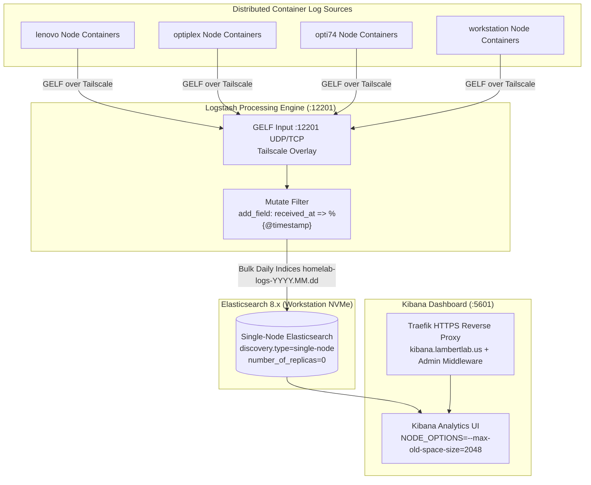

# Security Information & Event Management (SIEM) and Telemetry Architecture

Centralized log telemetry and security observability in **LambertLab** are powered by the **ELK Stack** (Elasticsearch, Logstash, Kibana) acting as the centralized **Security Information and Event Management (SIEM)** platform, running on dedicated bare-metal host compute with high-speed local NVMe storage.

---

## 📊 Centralized Log Analytics & SIEM Pipeline



---

## 🔬 ELK Stack (Elasticsearch, Logstash, Kibana) Configuration & Compute Realities

The ELK stack is deployed in Docker on `workstation` via Terraform (`docker/workstation/elk-stack.tf`), taking advantage of its 16-core / 32-thread Xeon CPU and dedicated high-speed NVMe storage:

### 1. Ingestion Protocol: Docker GELF over Tailscale (Port 12201 UDP/TCP)
Docker daemons across all cluster nodes stream container `stdout` and `stderr` directly to Logstash over the private Tailscale mesh network:
* **Zero Local Disk Wear:** Container logs stream over network buffers directly into Logstash, eliminating local disk log rotation wear across manager and worker nodes.
* **Unified Pipeline:** Logstash tags incoming events with a `received_at` timestamp and indexes them directly into daily indices:
  ```ruby
  filter {
    mutate {
      add_field => { "received_at" => "%{@timestamp}" }
    }
  }
  ```

---

### 2. The Single-Node Index Lifecycle Management (ILM) Rule (`number_of_replicas: 0`)

In a homelab environment where Elasticsearch operates as a high-performance single-node instance:

!!! danger "Crucial Elasticsearch Cluster Health Rule"
    Elasticsearch defaults new indices to `number_of_replicas: 1`. In a single-node cluster (configured with `discovery.type=single-node`), there is only one node (`workstation`). Elasticsearch refuses to allocate a replica shard on the same physical node as the primary shard, leaving the replica permanently unassigned. Because the cluster cannot fulfill its replica policy, its health status degrades to **`YELLOW`**.
    
    When cluster status is Yellow, Elasticsearch **Index Lifecycle Management (ILM)** policies often pause or refuse to advance indices through Rollover, Warm, and Delete phases.
    
    **Requirement:** All index templates and ILM policies MUST explicitly enforce `number_of_replicas: 0`. This guarantees cluster health remains solid **`GREEN`**, ensuring automated rollover and storage pruning continue smoothly without human intervention.

```json
{
  "index": {
    "number_of_shards": 1,
    "number_of_replicas": 0,
    "refresh_interval": "5s"
  }
}
```

---

### 3. Storage Hygiene: NVMe Isolation vs Network iSCSI
Elasticsearch index operations generate heavy, unbuffered random read/write I/O patterns:
* **Strict Rule:** Elasticsearch index data (`/usr/share/elasticsearch/data`) **must never** reside on 1Gbps network iSCSI or NFS shares. Network storage latency introduces heavy write queuing, thread pool exhaustion (`write` queue rejection), and causes Kibana dashboards to time out.
* **Architecture:** Dedicated bind mount targeting local workstation NVMe SSD storage (`var.elasticsearch_data_path`), delivering extreme random write IOPS with zero network jitter.

---

### 4. Kibana Memory Optimization
Kibana runs on Node.js. When executing deep time-range queries across millions of log entries, the default Node.js V8 heap limit (1.4 GB) can trigger Out-Of-Memory (OOM) fatal process crashes (`JavaScript heap out of memory`).

In `docker/workstation/elk-stack.tf`, Kibana is provisioned with:
```bash
NODE_OPTIONS=--max-old-space-size=2048
```
Increasing the heap ceiling to 2048 MB ensures smooth visual aggregation and uninterrupted log exploration.

---

### 5. Centralized Fleet Server & Elastic Agent DaemonSet

To capture container logs (`/var/log/pods`), cluster-level health, and bare-metal host OS telemetry (`journald`, `auth.log`, `syslog`) across all 4 nodes (`lenovo`, `optiplex`, `opti74`, `workstation`), the cluster utilizes **Elastic Fleet Server** and the official **Elastic Agent Helm Chart**:

* **Fleet Server (`workstation` :8220):**
  Deployed via Terraform (`docker/workstation/elk-stack.tf`) attached to the Docker `elk` network, communicating directly with Elasticsearch (`http://elasticsearch:9200`). Exposes port `8220` over the Tailscale overlay network (`https://100.106.96.18:8220`).
* **Fleet-Managed DaemonSet (`elastic-agent`):**
  Deployed via ArgoCD (`kubernetes/apps/elastic-agent.yaml`) utilizing the upstream Elastic Helm chart (`https://helm.elastic.co`, chart: `elastic-agent:9.5.4`).
  * **Pinned Image Tag:** Pinned to `9.3.2` to strictly adhere to Elastic's architectural requirement: $V_{\text{Agent}} \le V_{\text{Fleet Server}}$.
  * **System & Kubernetes Integrations:** With `system.enabled: true` and `preset: perNode`, exactly one agent pod runs on every cluster node, mounting `/var/log`, `/proc`, and `/sys` to monitor host OS telemetry and container logs simultaneously with zero duplication.
  * **Secret Decoupling:** Uses `tokenFromSecret` referencing Kubernetes secret `elastic-agent-token` in `kube-system`. Plaintext enrollment tokens are never committed to Git.
  * **Memory Sizing:** Resource limits configured with `memory: 2000Mi` in `kubernetes/elastic-agent/values.yaml` to ensure agents do not encounter OOMKilled restarts during high-volume log bursts.
  * **Fleet Server Policy Hygiene:** The standalone Fleet Server container on `workstation` runs unprivileged in Docker with its own PID namespace; its policy omits host `system.process` checks to prevent permission denied errors (the workstation K3s DaemonSet agent handles all workstation host metrics).

---

### 6. Planned Dashboards & Discover Views (Target Roadmap)

Homelab telemetry streams into the `logs-*` and `metrics-*` data views in Kibana (`https://kibana.lambertlab.us`). The following curated searches and operational dashboards represent the target implementation roadmap:

#### A. Target Discover Saved Searches

| View Name | Target Dataset / Filter | Recommended Columns | Purpose |
|:---|:---|:---|:---|
| **Host Sudo Audit** | `data_stream.dataset: "system.auth" and process.name: "sudo"` | `host.hostname`, `process.name`, `system.auth.sudo.command`, `message` | Complete audit trail of elevated privileged commands across all nodes. |
| **Failed SSH Logins** | `data_stream.dataset: "system.auth" and process.name: "sshd" and (message: ("Failed" or "Invalid") or system.auth.ssh.event: "Failed")` | `host.hostname`, `user.name`, `source.ip`, `message` | Detect brute-force attempts and unauthorized user logins. |
| **Kernel OOM Killer** | `message: (*oom* or "Out of memory" or "invoked oom-killer" or "Killed process") or process.name: "kernel"` | `host.hostname`, `process.name`, `message` | Track memory starvation events and kernel kills across nodes. |
| **Systemd Unit Failures** | `message: ("Failed to start" or "Unit entered failed state" or "Failed with result")` | `host.hostname`, `process.name`, `message` | Identify host daemon crashes (`containerd`, `k3s`, `docker`, `tailscale`). |
| **Pod CrashLoopBackOff** | `data_stream.dataset: "kubernetes.container_logs" and (log.level: ("error" or "fatal") or message: ("CrashLoopBackOff" or "panic:"))` | `kubernetes.namespace`, `kubernetes.pod.name`, `kubernetes.container.name`, `message` | Instant detection of crashing or restarting cluster workloads. |
| **Longhorn Storage Alerts** | `kubernetes.namespace: "longhorn-system" and (log.level: ("error" or "warning") or message: ("failed" or "degraded" or "timeout"))` | `kubernetes.pod.name`, `log.level`, `message` | Storage engine alerts, degraded replicas, and detachments. |
| **ArgoCD GitOps Errors** | `kubernetes.namespace: "argocd" and (log.level: ("error" or "warning") or message: ("ComparisonError" or "failed to sync"))` | `kubernetes.pod.name`, `log.level`, `message` | Sync failures, repo connection timeouts, and manifest errors. |
| **Traefik Ingress 5xx** | `kubernetes.namespace: "traefik" and (message: (" 500 " or " 502 " or " 503 " or " 504 ") or log.level: "error")` | `kubernetes.pod.name`, `message` | Reverse proxy backend connection and gateway errors. |
| **Cert-Manager TLS Renewal**| `kubernetes.namespace: "cert-manager" and (message: ("Renewing" or "Order" or "error" or "failed") or log.level: "error")` | `kubernetes.pod.name`, `log.level`, `message` | ACME challenge validation and Let's Encrypt certificate renewal tracking. |
| **KubeVirt & VM Lifecycle** | `kubernetes.namespace: ("kubevirt" or "cdi" or "vms" or "gaming") and (log.level: ("error" or "warning") or message: ("VMI" or "error" or "failed"))` | `kubernetes.namespace`, `kubernetes.pod.name`, `message` | VM provisioning, virt-launcher pod errors, and disk import tracking. |

#### B. Target Operational Dashboards

* **Homelab Security & Access Operations:**
  * **Panels:** Failed SSH attempts table / geographic breakdown, Sudo execution timeline, active SSH session counter, elevated command audit table.
* **Cluster Reliability & Pod Crash Center:**
  * **Panels:** Restarts by namespace (bar chart), CrashLoopBackOff log stream, OOM killer event stream, unhandled pod exceptions.
* **Storage & Edge Ingress Health:**
  * **Panels:** Longhorn replica degradation events, Traefik HTTP status code distribution (2xx vs 4xx vs 5xx), Cert-Manager renewal certificate status timeline.


