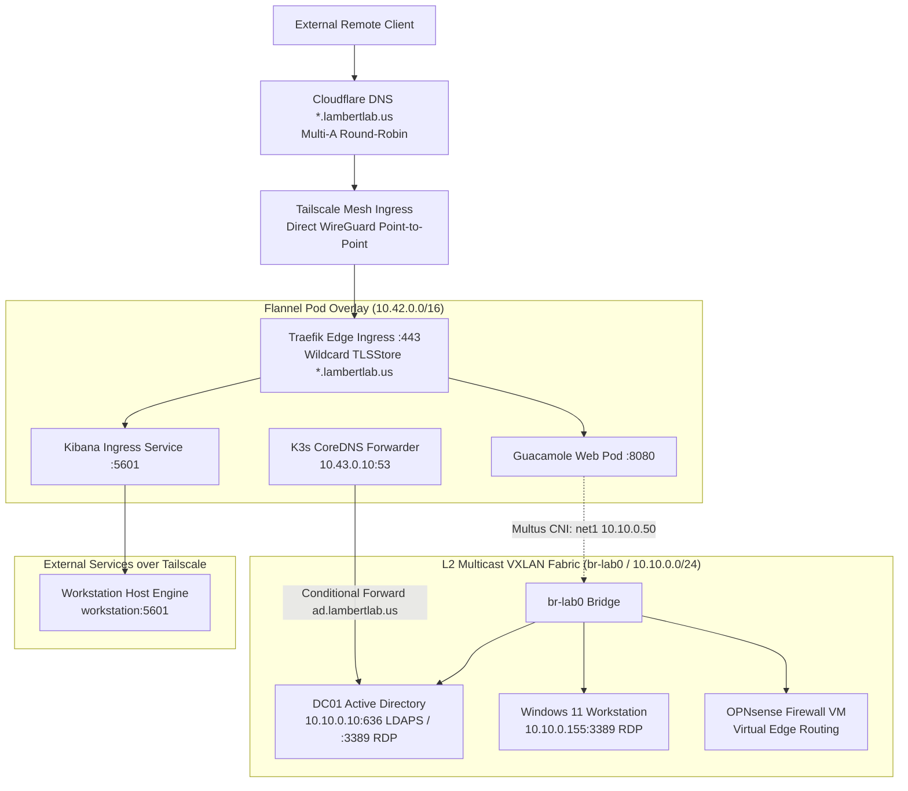
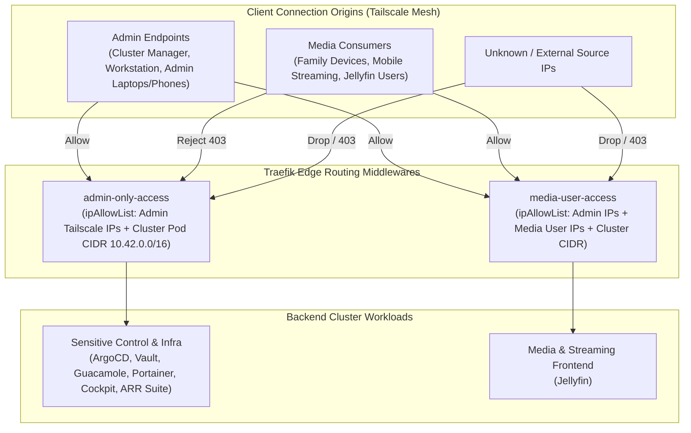

# L2 VXLAN Overlay & CoreDNS Architecture

The **LambertLab** network combines software-defined Layer 2 multicast tunneling, conditional Active Directory DNS forwarding, hardware NIC offload tuning, and multi-cloud edge ingress.

---

## 🌐 Network Topology Overview



---

## 🚪 Edge Ingress & Tailscale Round-Robin

External access to cluster services is secured without exposing public listening ports or relying on dynamic DNS port-forwarding:

1. **Cloudflare Multi-A Round-Robin:** `cloudflare.tf` maintains wildcard DNS records (`*.lambertlab.us`) resolving to the Tailscale IPv4 addresses of physical nodes (`lenovo`, `optiplex`, `opti74`, `workstation`).
2. **Client IP Preservation:** Because traffic terminates directly on nodes via Tailscale WireGuard sockets rather than traversing an intermediate SNAT gateway proxy, original client IP addresses are preserved for Traefik security middlewares.
3. **Traefik Default TLSStore:** Cert-Manager issues a single wildcard certificate (`*.lambertlab.us`) via Cloudflare DNS-01 challenges stored in `kube-system`. Traefik automatically references this certificate across all Ingress and IngressRoute resources:

```yaml
# kubernetes/config/tls-store.yaml
apiVersion: traefik.io/v1alpha1
kind: TLSStore
metadata:
  name: default
  namespace: kube-system
spec:
  defaultCertificate:
    secretName: wildcard-lambertlab-us-tls
```

---

## 🛡️ Two-Tier Zero-Trust Ingress Filtering (Traefik Middlewares)

Cluster Ingress resources do not rely solely on application passwords or SSO; Traefik enforces network-level isolation using declarative `Middleware` resources (`kubernetes/config/access-control-list-middleware.yaml`) that inspect client source IP addresses before requests ever touch upstream application pods:



### 1. `admin-only-access` (Tier 1: Administrative Protection)
* **Scope:** Applied across all sensitive infrastructure, GitOps, virtualization, secrets, and management ingresses (`argocd`, `vault`, `guacamole`, `portainer`, `cockpit`, `code-server`, `nas`, `firefox`, `sonarr`, `radarr`, `prowlarr`).
* **Source Allowlist:**
  * Dedicated physical node endpoints (`lenovo`, `optiplex`, `opti74`, `workstation`).
  * Primary administrative portable devices (laptops and administrative mobile clients).
  * In-cluster CNI pod network (`10.42.0.0/16`) to preserve internal service-to-service hairpinned routing.
  * Localhost loopback (`127.0.0.1/32`).
* **Result:** Even if an ingress endpoint URL is known or discovered, unauthorized requests receive an immediate HTTP 403 Forbidden at the Traefik proxy edge.

### 2. `media-user-access` (Tier 2: Scoped Consumer Access)
* **Scope:** Applied exclusively to end-user facing media portals (such as Jellyfin streaming).
* **Source Allowlist:**
  * All administrative endpoints from Tier 1.
  * Designated family and media client devices connected to the Tailscale mesh.
  * Internal cluster CNI and dashboard endpoints.
* **Result:** Grants media streaming access to trusted family clients while completely blocking them from querying administrative tools, databases, or cluster control planes.

---

## 🌉 Software-Defined L2 Fabric (`br-lab0`)

Instead of requiring expensive managed switches with 802.1Q VLAN trunking, the cluster implements a **multicast VXLAN overlay** managed declaratively by **NMState**:

* **Bridge Name:** `br-lab0`
* **Underlay Interface:** `vxlan-lab` (VNI `100`, multicast group `239.1.1.1`, port `4789`)
* **Static Host Gateways:**
  * `lenovo`: `10.10.0.2/24`
  * `optiplex`: `10.10.0.3/24`
  * `opti74`: `10.10.0.4/24`
  * `workstation`: `10.10.0.5/24`

### Multus CNI Secondary Interface Attachment
Standard Kubernetes pods only receive a Flannel overlay IP (`10.42.x.x`). Using **Multus CNI**, select pods (like Apache Guacamole) are provisioned with a secondary interface (`net1`) plugged directly into `br-lab0`:

```yaml
# NetworkAttachmentDefinition in default / target namespace
apiVersion: k8s.cni.cncf.io/v1
kind: NetworkAttachmentDefinition
metadata:
  name: lab-lan-bridge
spec:
  config: '{
    "cniVersion": "0.3.1",
    "name": "lab-lan-bridge",
    "type": "bridge",
    "bridge": "br-lab0",
    "hairpinMode": false
  }'
```

```yaml
# Pod Annotation on Guacamole Deployment
k8s.v1.cni.cncf.io/networks: '[{
  "name": "lab-lan-bridge",
  "ips": ["10.10.0.50/24"]
}]'
```

!!! tip "Hairpin Mode & IPv6 DAD Resolution"
    Early testing revealed that enabling `hairpinMode: true` on Linux bridges caused duplicate address detection (DAD) packet reflections back to KubeVirt VM interfaces. Setting `"hairpinMode": false` completely eliminates DAD loopbacks while allowing full cross-VM and Pod-to-VM communication.

---

## 🔍 CoreDNS Conditional Forwarding to Active Directory

Kubernetes pods routinely need to resolve domain-joined machines like `dc01.ad.lambertlab.us` or `win11-01.ad.lambertlab.us`.

Because Windows clients update their DNS dynamically via Active Directory Dynamic DNS (DDNS), cluster CoreDNS forwarders are configured with **active health checking**:

```yaml
# kubernetes/config/coredns-custom.yaml
ad.lambertlab.us:53 {
    forward . 10.10.0.10 {
        health_check 5s
        max_fails 2
    }
    cache 30
    reload
}
```

### Why Health-Checking is Essential
Without `health_check 5s` and `max_fails 2`, if DC01 reboots or a worker node faces transient network latency, CoreDNS pods hang waiting on UDP timeouts (30+ seconds), stalling applications across the cluster. With active health-checks, degraded upstream forwarders fail fast (< 5s) and seamlessly route to healthy replicas.

---

## ⚡ Intel I219-LM NIC Hardware Offload Optimization

Worker nodes utilizing Intel I219-LM Ethernet controllers (`optiplex` and `opti74`) running the Linux `e1000e` kernel driver can experience sporadic hardware micro-hangs and watchdog resets (`e1000e: Detected Hardware Unit Hang`) during sustained Gigabit packet bursts.

To eliminate driver lockups, an Ansible automation playbook applies deterministic `ethtool` offload adjustments during boot:

```yaml
- name: Disable problematic hardware offloads on I219-LM
  ansible.builtin.command:
    cmd: ethtool -K {{ ansible_default_ipv4.interface }} rx off tx off tso off gso off
```

Disabling TCP segmentation offload (TSO) and generic segmentation offload (GSO) offloads packet framing to the Linux kernel network stack, completely eliminating hardware controller state corruption.

---

## 🔄 Internal VM Hairpin Routing

KubeVirt virtual machines (such as `dc01` and `win11`) reside on the `10.10.0.0/24` L2 VXLAN subnet and do not run Tailscale clients. When VMs need to query cluster services published over external Traefik URLs (e.g. `https://vault.lambertlab.us` or `https://guacamole.lambertlab.us`):

* **Traffic Path:** OPNsense routes `100.64.0.0/10` LAN traffic to the Traefik Service ClusterIP (`10.43.204.125:443`).
* **Rule:** Always route internal VM traffic targeting cluster ingress to the Traefik Service ClusterIP, never to a physical node's local LAN IP.
