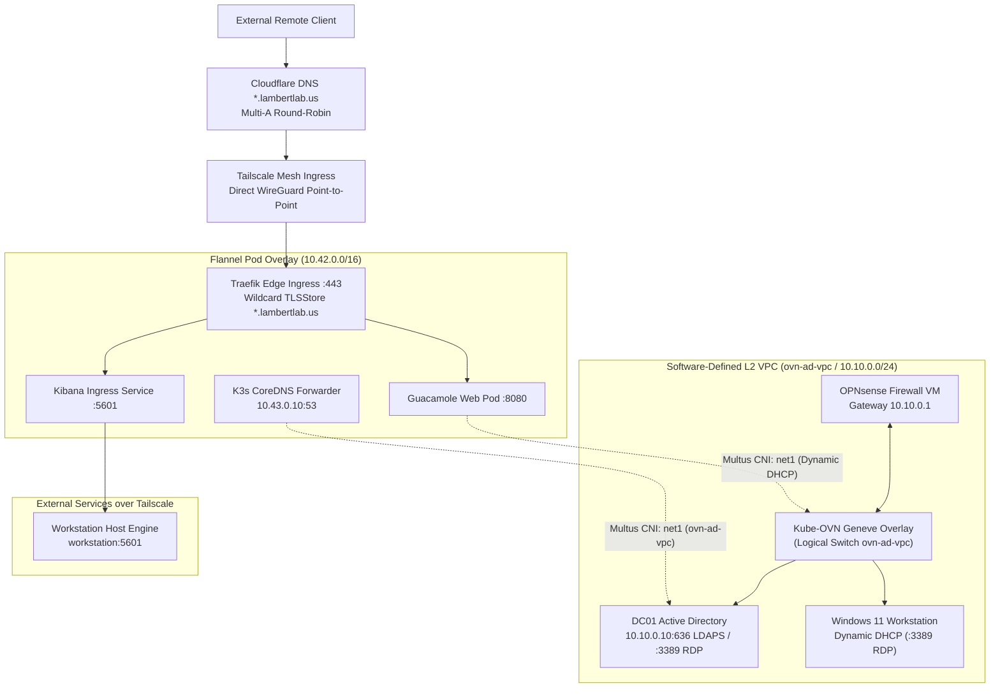
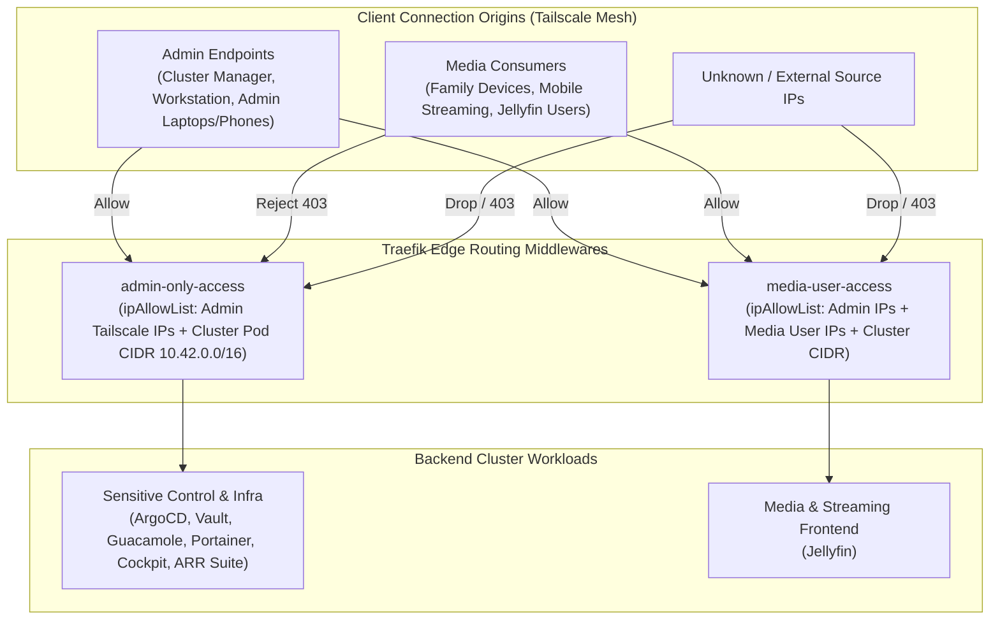

# Software-Defined L2 VPC & CoreDNS Architecture

The **LambertLab** network combines software-defined Layer 2 Geneve VPC tunneling via **Kube-OVN**, conditional Active Directory DNS forwarding over Multus, hardware NIC offload tuning, and multi-cloud edge ingress.

---

## 🌐 Network Topology Overview


```mermaid
graph TD
    Client["External Remote Client"] --> CF["Cloudflare DNS *.lambertlab.us<br/>Multi-A Round-Robin"]
    CF --> TS["Tailscale Mesh Ingress<br/>Direct WireGuard Point-to-Point"]
    TS --> Traefik["Traefik Edge Ingress :443<br/>Wildcard TLSStore *.lambertlab.us"]
    
    subgraph Flannel["Flannel Pod Overlay (10.42.0.0/16)"]
        Traefik --> GuacPod["Guacamole Web Pod :8080"]
        Traefik --> KibanaPod["Kibana Ingress Service :5601"]
        CoreDNS["K3s CoreDNS Forwarder<br/>10.43.0.10:53"]
    end
    
    subgraph OVN["Software-Defined L2 VPC (ovn-ad-vpc / 10.10.0.0/24)"]
        OVNSwitch["Kube-OVN Geneve Overlay<br/>(Logical Switch ovn-ad-vpc)"]
        OPNsense["OPNsense Firewall VM<br/>Gateway 10.10.0.1"] <--> OVNSwitch
        GuacPod -.->|"Multus CNI: net1 (Dynamic DHCP)"| OVNSwitch
        OVNSwitch --> DC01["DC01 Active Directory<br/>10.10.0.10:636 LDAPS / :3389 RDP"]
        OVNSwitch --> Win11["Windows 11 Workstation<br/>Dynamic DHCP (:3389 RDP)"]
        CoreDNS -.->|"Multus CNI: net1 (ovn-ad-vpc)"| DC01
    end

    subgraph External["External Services over Tailscale"]
        KibanaPod --> WorkstationNode["Workstation Host Engine<br/>workstation:5601"]
    end
```

---

## 🚪 Edge Ingress & Tailscale Round-Robin

External access to cluster services is secured without exposing public listening ports or relying on dynamic DNS port-forwarding:

1. **Cloudflare Multi-A Round-Robin:** `cloudflare.tf` maintains wildcard DNS records (`*.lambertlab.us`) resolving to the Tailscale IPv4 addresses of physical nodes (`lenovo`, `optiplex`, `opti74`, `workstation`).
2. **Client IP Preservation:** Because traffic terminates directly on nodes via Tailscale WireGuard sockets rather than traversing an intermediate SNAT gateway proxy, original client IP addresses are preserved for Traefik security middlewares.
3. **Traefik Default TLSStore:** Cert-Manager issues a single wildcard certificate (`*.lambertlab.us`) via Cloudflare DNS-01 challenges stored in `kube-system`. Traefik automatically references this certificate across all Ingress and IngressRoute resources:

```yaml
# kubernetes/config/tls-store.yaml
apiVersion: traefik.io/v1alpha1
kind: TLSStore
metadata:
  name: default
  namespace: kube-system
spec:
  defaultCertificate:
    secretName: wildcard-lambertlab-us-tls
```

---

## 🛡️ Two-Tier Zero-Trust Ingress Filtering (Traefik Middlewares)

Cluster Ingress resources do not rely solely on application passwords or SSO; Traefik enforces network-level isolation using declarative `Middleware` resources (`kubernetes/config/access-control-list-middleware.yaml`) that inspect client source IP addresses before requests ever touch upstream application pods:


```mermaid
graph TD
    subgraph ClientTiers["Client Connection Origins (Tailscale Mesh)"]
        AdminClients["Admin Endpoints<br/>(Cluster Manager, Workstation, Admin Laptops/Phones)"]
        MediaClients["Media Consumers<br/>(Family Devices, Mobile Streaming, Jellyfin Users)"]
        Untrusted["Unknown / External Source IPs"]
    end

    subgraph TraefikMiddlewares["Traefik Edge Routing Middlewares"]
        AdminACL["admin-only-access<br/>(ipAllowList: Admin Tailscale IPs + Cluster Pod CIDR 10.42.0.0/16)"]
        MediaACL["media-user-access<br/>(ipAllowList: Admin IPs + Media User IPs + Cluster CIDR)"]
    end

    subgraph ProtectedWorkloads["Backend Cluster Workloads"]
        AdminPortal["Sensitive Control & Infra<br/>(ArgoCD, Vault, Guacamole, Portainer, Cockpit, ARR Suite)"]
        MediaPortal["Media & Streaming Frontend<br/>(Jellyfin)"]
    end

    AdminClients -->|"Allow"| AdminACL
    MediaClients -->|"Reject 403"| AdminACL
    Untrusted -->|"Drop / 403"| AdminACL

    AdminClients -->|"Allow"| MediaACL
    MediaClients -->|"Allow"| MediaACL
    Untrusted -->|"Drop / 403"| MediaACL

    AdminACL --> AdminPortal
    MediaACL --> MediaPortal
```

### 1. `admin-only-access` (Tier 1: Administrative Protection)
* **Scope:** Applied across all sensitive infrastructure, GitOps, virtualization, secrets, and management ingresses (`argocd`, `vault`, `guacamole`, `portainer`, `cockpit`, `code-server`, `nas`, `firefox`, `sonarr`, `radarr`, `prowlarr`).
* **Source Allowlist:**
  * Dedicated physical node endpoints (`lenovo`, `optiplex`, `opti74`, `workstation`).
  * Primary administrative portable devices (laptops and administrative mobile clients).
  * In-cluster CNI pod network (`10.42.0.0/16`) to preserve internal service-to-service hairpinned routing.
  * Localhost loopback (`127.0.0.1/32`).
* **Result:** Even if an ingress endpoint URL is known or discovered, unauthorized requests receive an immediate HTTP 403 Forbidden at the Traefik proxy edge.

### 2. `media-user-access` (Tier 2: Scoped Consumer Access)
* **Scope:** Applied exclusively to end-user facing media portals (such as Jellyfin streaming).
* **Source Allowlist:**
  * All administrative endpoints from Tier 1.
  * Designated family and media client devices connected to the Tailscale mesh.
  * Internal cluster CNI and dashboard endpoints.
* **Result:** Grants media streaming access to trusted family clients while completely blocking them from querying administrative tools, databases, or cluster control planes.

---

## 🌉 Kube-OVN Software-Defined L2 VPC (`ovn-ad-vpc`)

The cluster utilizes **Kube-OVN** as a powerful Software-Defined Networking (SDN) overlay, replacing the legacy `br-lab0` NMState Linux bridge. Kube-OVN builds on top of Open vSwitch (OVS) and OVN to provide advanced enterprise features—such as isolated Virtual Private Clouds (VPCs), distributed routing, embedded IP Address Management (IPAM), and strict Layer-2 isolation—directly within Kubernetes.

By leveraging Geneve UDP encapsulation, Kube-OVN abstracts the physical network topology. This ensures seamless Layer 2 broadcast domains even across tricky underlay environments (such as Wi-Fi networks which typically drop foreign MACs and multicast frames).

* **VPC Name:** `ovn-cluster` (Logical Router) -> `ovn-ad-vpc` (Logical Switch)
* **Subnet CIDR:** `10.10.0.0/24`
* **OPNsense Gateway IP:** `10.10.0.1`

### Why We Migrated from NMState `br-lab0`
Previously, the cluster relied on a multicast VXLAN overlay (`br-lab0`) managed declaratively by NMState (NetworkManager State). 
While NMState is great for declarative host networking, it heavily manipulates host `iptables` and binds virtual bridges directly to physical host interfaces. Kube-OVN is a much better implementation for Kubernetes because it utilizes a pure Software-Defined Geneve overlay that is completely decoupled from host routing rules and physical network quirks (like Wi-Fi access points aggressively dropping foreign MACs). Additionally, Kube-OVN provides native IP Address Management (IPAM) for seamless DHCP, eliminating the need to manually track static IPs across virtual bridges.

### Multus CNI Secondary Interface Attachment
Standard Kubernetes pods receive a Flannel overlay IP (`10.42.x.x`). Using **Multus CNI**, select pods (like Apache Guacamole and CoreDNS) are provisioned with a secondary interface (`net1`) plugged directly into the Kube-OVN `ovn-ad-vpc` VPC.

Because the Kube-OVN provider suffix ends in `.ovn`, Kube-OVN intercepts the Multus attachment and executes IPAM allocation.

```yaml
# Pod Annotation on Guacamole Deployment (Dynamic DHCP)
k8s.v1.cni.cncf.io/networks: vms/ovn-ad-vpc
```

```yaml
# Pod Annotation for VM or CoreDNS (Static IP Allocation)
k8s.v1.cni.cncf.io/networks: vms/ovn-ad-vpc
ovn-ad-vpc.vms.ovn.kubernetes.io/ip_address: 10.10.0.10
```

[Read more about Kube-OVN Advanced Subnets & Multus IPAM here](https://kubeovn.github.io/docs/v1.16.x/en/advance/multi-nic/).

### CoreDNS Integration into the VPC
Because OVN VPCs are completely isolated Layer-2 broadcast domains with strict security, standard Pods cannot reach them by default. 
To enable the cluster to resolve Active Directory queries (`dc01.ad.lambertlab.us`), the `coredns` deployment in `kube-system` is patched to attach a secondary Multus interface directly to `ovn-ad-vpc`. This gives CoreDNS a secure, direct path to forward DNS queries to `10.10.0.10`.

---

## 🔍 CoreDNS Conditional Forwarding to Active Directory

Kubernetes pods routinely need to resolve domain-joined machines like `dc01.ad.lambertlab.us` or `win11-01.ad.lambertlab.us`.

Because Windows clients update their DNS dynamically via Active Directory Dynamic DNS (DDNS), cluster CoreDNS forwarders are configured with **active health checking**:

```yaml
# kubernetes/config/coredns-custom.yaml
ad.lambertlab.us:53 {
    forward . 10.10.0.10 {
        health_check 5s
        max_fails 2
    }
    cache 30
    reload
}
```

### Why Health-Checking is Essential
Without `health_check 5s` and `max_fails 2`, if DC01 reboots or a worker node faces transient network latency, CoreDNS pods hang waiting on UDP timeouts (30+ seconds), stalling applications across the cluster. With active health-checks, degraded upstream forwarders fail fast (< 5s) and seamlessly route to healthy replicas.

---

## ⚡ Intel I219-LM NIC Hardware Offload Optimization

Worker nodes utilizing Intel I219-LM Ethernet controllers (`optiplex` and `opti74`) running the Linux `e1000e` kernel driver can experience sporadic hardware micro-hangs and watchdog resets (`e1000e: Detected Hardware Unit Hang`) during sustained Gigabit packet bursts.

To eliminate driver lockups, an Ansible automation playbook applies deterministic `ethtool` offload adjustments during boot:

```yaml
- name: Disable problematic hardware offloads on I219-LM
  ansible.builtin.command:
    cmd: ethtool -K {{ ansible_default_ipv4.interface }} rx off tx off tso off gso off
```

Disabling TCP segmentation offload (TSO) and generic segmentation offload (GSO) offloads packet framing to the Linux kernel network stack, completely eliminating hardware controller state corruption.

---

## 🔄 Internal VM Hairpin Routing

KubeVirt virtual machines (such as `dc01` and `win11`) reside on the `10.10.0.0/24` Kube-OVN Geneve VPC subnet and do not run Tailscale clients. When VMs need to query cluster services published over external Traefik URLs (e.g. `https://vault.lambertlab.us` or `https://guacamole.lambertlab.us`):

* **Traffic Path:** OPNsense routes `100.64.0.0/10` LAN traffic to the Traefik Service ClusterIP (`10.43.204.125:443`).
* **Rule:** Always route internal VM traffic targeting cluster ingress to the Traefik Service ClusterIP, never to a physical node's local LAN IP.
