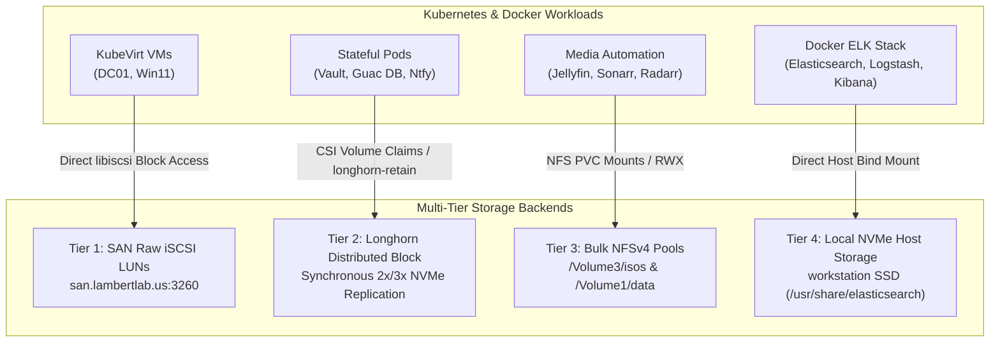

# Storage Hierarchy & SAN Architecture

The **LambertLab** storage infrastructure follows a clear tiered strategy designed to match workload I/O characteristics with optimal backend protocols.

---

## 💾 Storage Topology & Workload Mapping



---

## 💾 Storage Tiers Matrix

| Storage Tier | Backend Protocol | Host Provider | Primary Use Cases | Performance Characteristics |
| :--- | :--- | :--- | :--- | :--- |
| **Tier 1: SAN iSCSI** | iSCSI Block Targets | TerraMaster F4-425 Plus (`san.lambertlab.us`) | KubeVirt VM boot disks (`win11-boot`, `dc01-disk`) | Lowest latency (< 2ms random I/O), direct block access, bypasses overlay filesystem overhead |
| **Tier 2: Distributed Block** | Longhorn CSI | Multi-Node K3s NVMe/SSDs | State-backed cluster pods (PostgreSQL, Redis, Vault, Ntfy) | Synchronous 2-3x cross-node replication, automated CSI volume snapshots, `longhorn-retain` policy |
| **Tier 3: Bulk Network File** | NFSv4 Pools | TerraMaster F4-425 Plus (`nas.lambertlab.us`) | Media libraries, ISO repositories (`/Volume3/isos`), VirtIO drivers | High-capacity bulk throughput, multi-client read/write sharing (ReadWriteMany) |
| **Tier 4: Local NVMe** | Direct Host Filesystem | `workstation` NVMe | Docker ELK Stack (Elasticsearch, Logstash, Kibana) indices | Extreme write IOPs for real-time security log indexing, zero network latency |

---

## 🧱 Tier 1: Low-Latency SAN iSCSI Targets

KubeVirt virtual machines require dedicated, high-performance block devices for guest operating system stability:

* **Target Portal:** `san.lambertlab.us:3260`
* **LUN Architecture:**
  * `iqn.2026-09.us.lambertlab:win11-boot` (LUN 0, 64 GiB) - Windows 11 Enterprise LTSC
  * `iqn.2026-09.us.lambertlab:dc01-disk` (LUN 0, 80 GiB) - Windows Server 2025 Domain Controller
* **Direct Line-Rate Flashing:** By using `qemu-img convert` with native `libiscsi` user-space drivers, master OS templates are written directly into LUNs at full line rate without needing intermediate 64GB Longhorn scratch volumes or triggering HTTP ingress proxy timeouts.

---

## 🛡️ Tier 2: Longhorn Distributed Block Storage

Critical cluster state (HashiCorp Vault storage, Apache Guacamole's PostgreSQL database, Ntfy message cache) is backed by Longhorn:

* **StorageClass Retention:** A custom StorageClass `longhorn-retain` enforces `reclaimPolicy: Retain` so that if ArgoCD applications are pruned or re-synced, underlying persistent volumes are never destroyed automatically.
* **Volume Snapshotting:** Longhorn schedules automated periodic volume snapshots distributed across healthy control plane nodes.
* **Multipath Daemon Blacklist (`multipathd`):** To prevent host multipath daemons from mistakenly locking Longhorn virtual iSCSI devices (causing `MountVolume.SetUp failed: already mounted or mount point busy`), worker nodes deploy a `devnode "^sd[a-z0-9]+"` blacklist to `/etc/multipath.conf` via `ansible/longhorn-reqs.yml` per the official [Longhorn Knowledge Base: Troubleshooting Volume Mount Failure with multipathd](https://longhorn.io/kb/troubleshooting-volume-with-multipath/).

```yaml
# kubernetes/longhorn/storageclass-retain.yaml
apiVersion: storage.k8s.io/v1
kind: StorageClass
metadata:
  name: longhorn-retain
provisioner: driver.longhorn.io
reclaimPolicy: Retain
volumeBindingMode: Immediate
allowVolumeExpansion: true
parameters:
  numberOfReplicas: "2"
  staleReplicaTimeout: "2880"
```

---

## 🚫 Storage Hygiene & Strict Rules

!!! danger "Critical Safety & Operational Rules"
    - **Prohibited Mounts:** Under no circumstances should automated scripts or tools inspect, modify, or run commands against `/mnt/blue_drive/`, `/mnt/black_drive/`, or `/mnt/media_data/`.
    - **Never Put Elasticsearch on Network Storage:** Elasticsearch indices MUST reside on local `workstation` NVMe. Staging high-IOPS write indices on 1Gbps network iSCSI causes severe indexing queues and thread pool exhaustion.
    - **Lenovo Root SSD Hygiene:** Lenovo's primary root SSD (`/dev/sda2`) is ~116 GB. Never stage 25+ GB VM disk images or ISOs directly on the manager node's root filesystem. Always upload templates directly to the NAS (`/Volume3/isos`).
