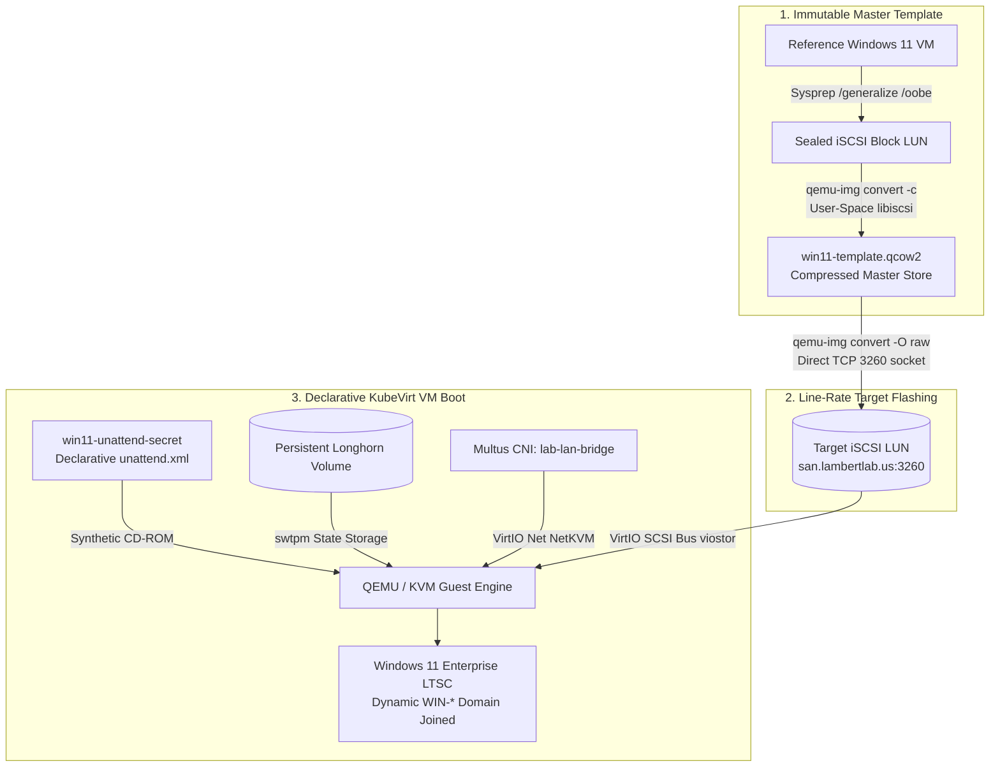

# Cloud-Native Virtualization Architecture (KubeVirt)

The **LambertLab** virtualization architecture leverages **KubeVirt v1.9.0** and the **Containerized Data Importer (CDI v1.66.0)** to converge traditional monolithic operating systems (Windows Server 2025, Windows 11 Enterprise, FreeBSD/OPNsense) and cloud-native container workloads into a **single, unified declarative control plane**.

---

## 🏛️ KubeVirt Lifecycle & Storage Architecture



---

## 📦 Virtualized Machine Portfolio

| Virtual Machine | Operating System | vCPU / RAM | Storage Backend | Network Interface | Primary Role |
| :--- | :--- | :--- | :--- | :--- | :--- |
| **`win11`** | Windows 11 Enterprise LTSC | 4 vCPU / 8 GiB | 64 GB SAN iSCSI LUN | `lab-lan-bridge` (VXLAN) | Domain-Joined Dedicated Admin Workstation |
| **`dc01`** | Windows Server 2025 | 4 vCPU / 8 GiB | 80 GB SAN iSCSI LUN | `lab-lan-bridge` (VXLAN) | Primary Active Directory Domain Controller (`ad.lambertlab.us`) |
| **`opnsense`** | FreeBSD 14 / OPNsense | 4 vCPU / 4 GiB | Distributed Longhorn Block | Host NIC Physical Bridge | Edge Gateway, NAT & Security Firewall |

---

## 🔬 Hypervisor Tuning & Windows 11 Hardware Compliance

Deploying Windows 11 under KVM requires strict hardware attestation compliance and specialized low-level hypervisor flags:

### 1. OVMF UEFI Secure Boot & Persistent vTPM 2.0
Windows 11 strictly enforces UEFI Secure Boot and a Trusted Platform Module (TPM 2.0):

```yaml
firmware:
  bootloader:
    efi:
      secureBoot: true
      persistent: true
features:
  smm:
    enabled: true
devices:
  tpm:
    persistent: true
```

* **`efi.secureBoot: true`:** Boots using Open Virtual Machine Firmware (OVMF) compiled with standard Microsoft Authenticode keys.
* **`efi.persistent: true`:** Persists EFI NVRAM variables across pod reboots, preventing bootloader priority loss.
* **`features.smm.enabled: true`:** System Management Mode emulation in QEMU, required by OVMF to safeguard the Secure Boot keystore from guest OS tampering.
* **`devices.tpm.persistent: true`:** Emulates a TPM 2.0 cryptographic chip using `swtpm`, backing its state volume with **Longhorn** distributed storage so BitLocker keys and Platform Configuration Registers (PCRs) survive VM migrations and host reboots.

---

### 2. Multi-vCPU Hyper-V Hypercall Optimizations
To eliminate hypervisor context switching and CPU core contention across the 4 vCPUs, KubeVirt exposes KVM's synthetic Hyper-V hypercall suite:

```yaml
features:
  hyperv:
    relaxed: {}
    vapic: {}
    spinlocks:
      spinlocks: 8191
    synic: {}
    synictimer:
      direct: {}
    reset: {}
    runtime: {}
    frequencies: {}
    reenlightenment: {}
    tlbflush: {}
    ipi: {}
    vpindex: {}
```

* **`tlbflush` & `ipi`:** Allows the Windows kernel to issue synthetic hypercalls for Translation Lookaside Buffer (TLB) flushes and Inter-Processor Interrupts (IPIs) across all virtual cores simultaneously, bypassing standard emulated APIC bottlenecks.
* **`synictimer.direct: {}`:** Delivers synthetic timer messages directly into guest architectural registers, avoiding costly VM exits.
* **`relaxed`:** Relaxes guest watchdog constraints during high host load, completely eliminating false-positive `CLOCK_WATCHDOG_TIMEOUT` Blue Screens of Death (BSOD).
* **`spinlocks (8191)`:** Forces Windows to yield execution after 8,191 failed spinlock attempts, avoiding wasteful thread spinning on contested locks.

---

### 3. Hardware Clocks & Timer Drift Prevention
Windows assumes physical hardware Real-Time Clocks (RTC) run in local time rather than UTC:

```yaml
clock:
  timezone: "America/New_York"
  timer:
    hpet:
      present: false
    pit:
      tickPolicy: delay
    rtc:
      tickPolicy: catchup
    hyperv: {}
```

* **`timezone: "America/New_York"`:** Offsets the emulated RTC directly to Eastern Time, eliminating automatic 4/5-hour time skews upon guest boot.
* **`hpet (present: false)`:** Disables high-overhead High Precision Event Timer emulation in favor of the hypervisor's invariant TSC (Time Stamp Counter).

---

## ⚡ Automated Sysprep Specialization Lifecycle

To achieve zero-touch desktop provisioning, master images are generalized via Microsoft Sysprep and customized on first boot using an unattended answer file:

### Phase 1: Machine Sealing
From an elevated prompt in the reference VM:
```cmd
C:\Windows\System32\Sysprep\sysprep.exe /generalize /oobe /shutdown
```
This purges the unique Machine SID, clears device driver databases, resets the event logging engine, and flags the Out-of-Box Experience (OOBE) for automated processing.

### Phase 2: Direct Line-Rate Flashing via `qemu-img`
Rather than uploading templates through Kubernetes CDI (which requires 64GB Longhorn scratch volumes and often triggers HTTP proxy timeouts on 25+ GB disks), the template is flashed directly to the SAN iSCSI target LUN using `libiscsi`:

```bash
qemu-img convert -p -f qcow2 -O raw \
  /mnt/nas-mount/templates/win11-template.qcow2 \
  iscsi://san.lambertlab.us/iqn.2026-09.us.lambertlab:win11-boot/0
```

### Phase 3: Declarative Specialization (`unattend.xml`)
The VM manifest mounts a Kubernetes Secret containing a declarative `unattend.xml` answer file as a virtual CD-ROM:
* **Dynamic Computer Naming:** Configured with `<ComputerName>*</ComputerName>`, prompting Windows setup to generate a random `WIN-XXXXXXXX` NetBIOS name, preventing computer object collisions in Active Directory.
* **Automated Domain Join:** Uses a restricted service account (`svc_domainjoin`) with delegated rights to place computer accounts into `OU=Computers,OU=LambertLab,DC=ad,DC=lambertlab,DC=us`.
* **Regional & OOBE Bypass:** Automatically suppresses EULA prompts, telemetry questions, Microsoft Account (MSA) login screens, and configures the default local administrator account.
