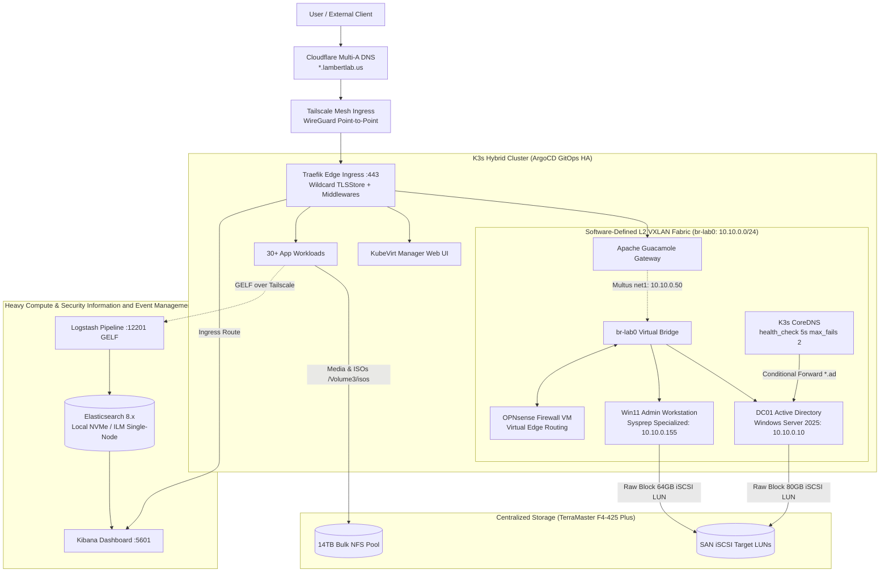

# LambertLab Infrastructure Documentation

Welcome to the central technical documentation and operational engineering knowledge base for the **LambertLab** hybrid cloud-native infrastructure.

---

## ⚡ Architecture Topology

---

## 🚀 Core Architectural Highlights

=== "Virtualization (KubeVirt)"
    - **Bare-Metal Virtualization:** High-performance Windows Server 2025 and Windows 11 Enterprise LTSC virtual machines managed natively alongside containerized microservices via KubeVirt v1.9.0.
    - **Hardware-Enforced Security:** OVMF UEFI Secure Boot paired with persistent virtual TPM 2.0 (`swtpm`) state volumes backed by Longhorn.
    - **Direct Line-Rate iSCSI Flashing:** Template images are converted directly from compressed QCOW2 into raw iSCSI block LUNs via `qemu-img convert` (`libiscsi`), completely bypassing HTTP ingress proxy idle timeouts and Longhorn 64GB scratch volume overhead.
    - **Automated Sysprep Specialization:** Dynamic `WIN-*` machine naming, zero-touch OOBE regional bypass, and least-privilege domain join automation via declarative `unattend.xml` answer files.

=== "Hybrid Identity & Remote Access"
    - **Dual Directory Model:** Seamless identity federation combining on-premises Active Directory (`ad.lambertlab.us`, NetBIOS `LAMBERTLAB`) with Microsoft Entra ID.
    - **Entra Cloud Sync:** Zero-touch Password Hash Synchronization (PHS) running under an Active Directory Group Managed Service Account (`provAgentgMSA$`).
    - **Clientless Remote Gateway:** Apache Guacamole provides browser-based HTML5 RDP/SSH access with Entra ID OIDC SSO, on-premises LDAPS authentication with custom Root CA JVM truststore injection, and native Multus L2 VXLAN pod networking.

=== "Software-Defined Networking"
    - **NMState Multicast VXLAN (`br-lab0`):** Multi-node Layer 2 broadcast overlay connecting physical nodes and virtual machines without requiring expensive 802.1Q managed switch VLAN trunking.
    - **Direct Pod Bridging (Multus CNI):** Apache Guacamole pod attaches a secondary interface (`net1`, `10.10.0.50/24`) directly into `br-lab0`, communicating with domain controllers and desktops at wire speed with zero NAT overhead.
    - **CoreDNS Conditional Health-Checking:** In-cluster CoreDNS conditionally routes `*.ad.lambertlab.us` to DC01 (`10.10.0.10`) with automated health checks (`health_check 5s`, `max_fails 2`) preventing cluster-wide UDP timeout cascades.
    - **Self-Healing Bridge Watchdog:** Lightweight Kubernetes DaemonSet continuously detects and recovers un-enslaved VXLAN links caused by asynchronous USB NIC boot latency.

=== "GitOps & Multi-Tier Storage"
    - **High-Availability GitOps:** ArgoCD HA with Redis Sentinel, controller sharding, and 5 dedicated AppProjects reconciling 30+ services across deterministic synchronization waves (0 to 3).
    - **Multi-Tiered Storage Matrix:** Dedicated TerraMaster SAN iSCSI block LUNs for low-latency VM disks, distributed Longhorn block storage with synchronous cross-node replication for databases, 14TB high-capacity NFS pools for bulk media, and dedicated local NVMe storage for real-time SIEM indexing.

=== "Security Information and Event Management (SIEM) & Telemetry"
    - **Centralized Log Ingestion (ELK Stack):** Cross-node Docker container logs streamed directly to Logstash in the ELK Stack (Elasticsearch, Logstash, Kibana) via Docker GELF drivers over Tailscale on port 12201.
    - **Strict Index Lifecycle Management (ILM) Retention Rule:** Single-node Elasticsearch configurations enforce `number_of_replicas: 0` across index templates to ensure green cluster health and prevent automated ILM rollover and pruning stalls.
    - **Workstation Compute Isolation:** Strict memory and CPU resource caps (`guacd` capped at 2 cores) preserve 30 Xeon threads and 20GB RTX compute for real-time Elasticsearch pipelines and machine learning workloads.

---

## 📖 Complete Documentation Index

### 🏛️ Architecture Deep-Dives
- [Hardware Architecture & Fleet Topology](architecture/hardware.md): Node hardware specifications, 3-node etcd Raft quorum, and workstation compute guardrails.
- [L2 Multicast VXLAN & CoreDNS Fabric](architecture/networking.md): NMState multicast VXLAN, Multus pod attachment, and CoreDNS health-checked forwarders.
- [Storage Hierarchy & SAN Architecture](architecture/storage.md): When and why to use SAN iSCSI vs Longhorn vs NFS vs local NVMe.
- [Hybrid Identity & Entra ID Federation](architecture/identity.md): Dual-directory identity, Cloud Sync gMSA, PHS, and RBAC security groups.
- [Apache Guacamole Gateway](architecture/guacamole.md): Clientless remote desktop, LDAPS Root CA JVM truststore injection, and OIDC SSO.
- [KubeVirt & Virtual Machine Lifecycle](architecture/virtualization.md): Bare-metal virtualization, Hyper-V enlightenments, Sysprep automation, and direct iSCSI flashing.
- [GitOps Engine & Synchronization Waves](architecture/gitops.md): ArgoCD HA architecture, AppProjects, sync wave topology, and self-healing.
- [Security Information and Event Management (SIEM) & Telemetry](architecture/logging.md): Centralized ELK Stack (Elasticsearch, Logstash, Kibana), Docker GELF over Tailscale, local NVMe isolation, and single-node Index Lifecycle Management (ILM) policies.

### 📦 Application Service Catalog
- [Catalog Overview & Master Matrix](catalog/index.md): Complete directory, cluster namespaces, Docker contexts, and ingress endpoints.
- [Core Infrastructure & Networking](catalog/infrastructure.md): ArgoCD, Traefik, Cert-Manager, NMState, Multus, CoreDNS, Tailscale, Longhorn, KubeVirt, and TerraMaster TOS.
- [Virtual Machines & Identity](catalog/workstations-vms.md): DC01, Windows 11 Workstation, OPNsense Gateway, KubeVirt Manager, and Apache Guacamole.
- [Media & Home Automation](catalog/media-automation.md): Jellyfin, Sonarr, Radarr, Prowlarr, Tdarr, and Palworld Dedicated Server.
- [Security & Productivity Tools](catalog/security-tools.md): HashiCorp Vault, External Secrets, ELK Stack (Elasticsearch, Logstash, Kibana), Homarr, Ntfy, Beszel, Pi-hole, Portainer, Firefox Sandbox, and developer tools.

### 🛠️ Operational Runbooks
- [Bridge Self-Healing Watchdog](runbooks/bridge-watchdog.md): Background, diagnosis, and automated recovery for USB NIC boot latency on `br-lab0`.
- [Direct iSCSI Line-Rate Flashing](runbooks/iscsi-flashing.md): Step-by-step user-space `qemu-img convert` flashing guide bypassing CDI and ingress timeouts.
- [ELK Stack & Index Lifecycle Management (ILM) Maintenance](runbooks/elk-ilm-maintenance.md): Managing single-node index templates, troubleshooting unassigned replica shards, and testing GELF pipelines.
- [Disaster Recovery & Cluster Quorum](runbooks/disaster-recovery.md): Host reboot sequence, etcd Raft recovery, KubeVirt VM restoration, and break-glass administrative procedures.
