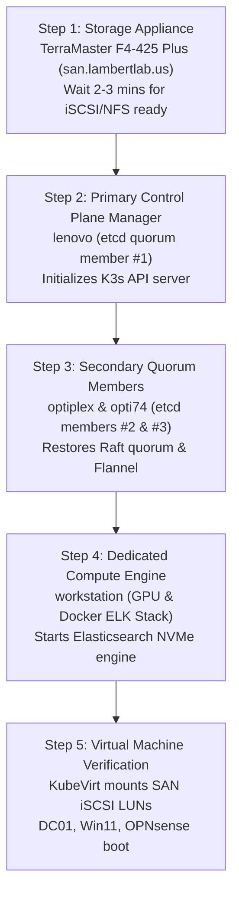

# Runbook: Disaster Recovery & Cluster Quorum Restoration

This runbook defines cold-boot boot sequencing, etcd Raft quorum recovery, KubeVirt virtual machine restoration, and emergency break-glass administrative procedures for the **LambertLab** infrastructure.

---

## ⚡ Deterministic Cold-Boot Boot Sequencing

Following a whole-home power failure or physical infrastructure maintenance, nodes must be booted in strict deterministic order to satisfy cross-service dependencies:



### Stage 1: Storage Appliance (`TerraMaster F4-425 Plus`)
Power on the NAS appliance first and wait until storage daemons initialize (~2–3 minutes):
* Verify TCP port 3260 (iSCSI target daemon) is listening.
* Verify NFS exports (`/Volume3/isos`, `/Volume1/data`) are accepting mount requests.
* *Failure Risk:* Booting Kubernetes nodes before SAN targets are online causes KubeVirt PVC mounts to enter `FailedMount` or `CrashLoopBackOff`.

### Stage 2: Manager Node (`lenovo`)
Power on `lenovo`. The K3s server supervisor boots and attempts to initialize the embedded etcd Raft engine:
* Check K3s service status:
  ```bash
  sudo systemctl status k3s
  ```

### Stage 3: Secondary Control Plane Members (`optiplex` & `opti74`)
Power on `optiplex` and `opti74` simultaneously:
* Once a second node joins, etcd re-establishes a majority quorum ($2/3$ members), and the Kubernetes API server begins accepting workload requests.
* Verify node cluster status:
  ```bash
  kubectl get nodes -o wide
  ```

### Stage 4: Heavy Compute Engine (`workstation`)
Power on `workstation`:
* K3s kubelet connects to the control plane.
* Docker engine starts the local ELK Stack (Elasticsearch, Logstash, Kibana), mounting local NVMe storage and opening GELF port 12201.

---

## ⚖️ etcd Raft Quorum Loss & Recovery

If two of the three control plane nodes suffer permanent hardware loss, etcd will lose Raft consensus and the API server will reject all write requests.

### Single Node Quorum Re-seeding (Disaster Recovery)
If only `lenovo` survives, force single-node etcd cluster bootstrapping:

1. Stop K3s on the surviving node:
   ```bash
   sudo systemctl stop k3s
   ```
2. Reset etcd cluster state on the single node:
   ```bash
   sudo k3s server --cluster-reset
   ```
3. Restart K3s:
   ```bash
   sudo systemctl start k3s
   ```
4. Once healthy, re-join worker nodes or replace failed control plane hardware using standard K3s join tokens.

---

## 🖥️ KubeVirt Virtual Machine Restoration

If virtual machines fail to resume automatically after a host reboot:

1. Inspect active VM status across the `vms` namespace:
   ```bash
   kubectl get vms -n vms
   kubectl get vmis -n vms
   ```
2. Start any stopped virtual machines:
   ```bash
   virtctl start dc01 -n vms
   virtctl start win11 -n vms
   ```
3. Verify underlying iSCSI SAN disk attachments:
   ```bash
   kubectl describe vmi win11 -n vms | grep -A 10 "Volumes"
   ```
4. Access direct out-of-band graphical consoles via VNC if guest OS networking fails:
   ```bash
   virtctl vnc win11 -n vms
   ```

---

## 🔑 Break-Glass Administrative Procedures

In the event of a catastrophic directory or federation failure:

| Failure Scenario | Emergency Access Vector | Operational Procedure |
| :--- | :--- | :--- |
| **On-Prem DC01 Failure** | Microsoft Entra ID Cloud Admin | Log into Azure / Entra portal using the emergency break-glass account (pure cloud Global Admin). Independent of on-premises AD or Kerberos. |
| **Entra ID / Internet Outage** | On-Premise Domain Admin | Access `dc01` or `win11` console directly via `virtctl vnc` using `LAMBERTLAB\chris` or the local machine administrator account. |
| **Guacamole SSO Unavailable** | Local `guacadmin` Account | Browse to `https://guacamole.lambertlab.us`. Because `EXTENSION_PRIORITY: "*,openid"` is configured, local DB authentication runs first. Log in directly with `guacadmin`. |
| **Vault Sealed on Reboot** | Vault Unseal Keys | If Vault unsealing is interrupted, execute `vault operator unseal` using the recovery Shamir unseal keys stored in the physical offline safe. |
